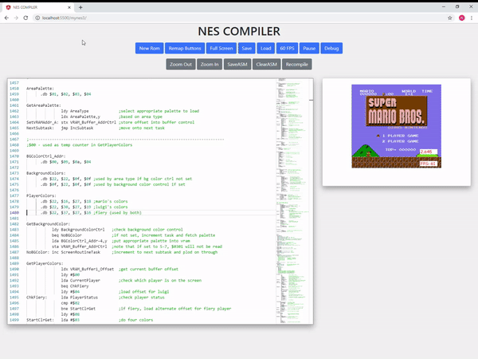

# Mario Compiler
This is a web based NES Compiler and Emulator which allows you to mess around with the Super Mario Bros source code and see the results in realtime. You will need your own Super Mario Bros rom for it to work. Everything runs in the browser, there is no server side code.

Come and feel what it was like to develop NES games back in the 80's! View demo here:

https://www.neilb.net/MarioCompiler/

Simply make edits in the code editor and then press Ctrl + S to save and recompile. 

# Background
I worked on this project because I wanted to see what was possible using only HTML and JavaScript. Normally when you think of Compilers and Code editors you would think of the desktop. The compiler is written in JavaScript while the Emulator I wrote with TypeScript. It does not use Webassembly. The Mario source code itself is a technical marvel. One of the most iconic games of our time, written in assembly and crammed into a measly 32 kilobytes. You can also try it with the sample code if you just want to learn about how 6502 assembly was used to build NES games.

Special thanks to nodeNES https://github.com/gutomaia/nodeNES who's compiler I used as a starting point. I had to heavily modify it in order to support the many advanced features the smb code uses. This includes things such as .db HIGH/LOW modifiers, variable constants, addressing +/-, dereferencing, indirect addressing, and many others. Also thanks to the Doppelganger SMB Dissasembly https://gist.github.com/1wErt3r/4048722 which I had to slightly modify in order to get it to work with the compiler. Enjoy!

# Technical Information
To Build the project first install TypeScript and the dependencies

`npm install -g typescript`

`npm install`

Then go into the source folder and run the TypeScript Compiler to build the JavaScript Files

`cd source`

`tsc`

